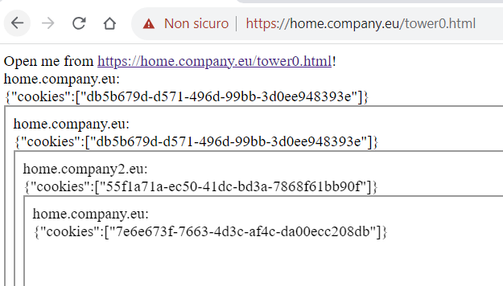

# README

Playground in order to locally test cookies behaviour in multi-domain use cases.

## Repository structure

- `nginx-1.25.2\html\index.html` frontend page to test cookie on several domains
- `cookies-be` java server to create cookie on a specific domain
- `nginx-1.25.2` the webserver that manages SSL + domains routing

## Tests

### Chrome

<https://home.company.eu/tower0.html>

The UUID shown in each iframe is the value of the cookie. If the value is different, the cookie is not propagated correctly.



## Quick access

Once env is up-and-running, you'll find resources here:

| URL                                                                      | Description                                                                  |
| ------------------------------------------------------------------------ | ---------------------------------------------------------------------------- |
| [api.home.company.eu](https://api.home.company.eu/cookies/test1)         | API endpoint                                                                 |
| [home.company.eu/](https://home.company.eu/index.html)                   | sub-domain, index.html                                                       |
| [home.company.eu/index2.html](https://home.company.eu/index2.html)       | sub-domain, index2.html. Includes also home.company2.eu domain as iframe     |
| [fe.home.company.eu/](https://fe.home.company.eu/index.html)             | sub-sub-domain, index.html                                                   |
| [fe.home.company.eu/index2.html](https://fe.home.company.eu/index2.html) | sub-sub-domain, index2.html. Includes also home.company2.eu domain as iframe |
| [home.company2.eu/](https://home.company2.eu/index.html)                 | cross-domain, index.html                                                     |
| [home.company.eu/tower0.html](https://home.company.eu/tower0.html)       | cross-domain, stack multiple iframes                                         |

## Setup local env

### Generate SSL certificates

```
$env:PATH=$env:PATH + 'C:\Program Files\Git\usr\bin'
openssl req -x509 -nodes -days 365 -newkey rsa:2048 -keyout C:/a/projects/vitalegi/cookies-playground/nginx-selfsigned.key -out C:/a/projects/vitalegi/cookies-playground/nginx-selfsigned.crt
```

```
PS C:\a\projects\vitalegi\cookies-playground\cookie-fe1> openssl req -x509 -nodes -days 365 -newkey rsa:2048 -keyout C:/a/projects/vitalegi/cookies-playground/nginx-selfsigned.key -out C:/a/projects/vitalegi/cookies-playground/nginx-selfsigned.crt
>>
Generating a RSA private key
........+++++
......................+++++
writing new private key to 'C:/a/projects/vitalegi/cookies-playground/nginx-selfsigned.key'
-----
You are about to be asked to enter information that will be incorporated
into your certificate request.
What you are about to enter is what is called a Distinguished Name or a DN.
There are quite a few fields but you can leave some blank
For some fields there will be a default value,
If you enter '.', the field will be left blank.
-----
Country Name (2 letter code) [AU]:
State or Province Name (full name) [Some-State]:
Locality Name (eg, city) []:
Organization Name (eg, company) [Internet Widgits Pty Ltd]:
Organizational Unit Name (eg, section) []:
Common Name (e.g. server FQDN or YOUR name) []:fe.company.eu
Email Address []:
```

### Configure hosts file

Update `C:\Windows\System32\drivers\etc\hosts` with

```
127.0.0.1	home.company.eu
127.0.0.1	home.company2.eu
127.0.0.1	fe.home.company.eu
127.0.0.1	api.home.company.eu
```

### Disable SSL validation

In the browser of your choice, open each domain and allow traffic.

### Nginx setup

<http://nginx.org/en/download.html>

`nginx.conf`'s server section

```
server {
    listen 443 ssl http2;
    server_name home.company.eu;
    ssl_certificate     C:/a/projects/vitalegi/cookies-playground/nginx-selfsigned.crt;
    ssl_certificate_key C:/a/projects/vitalegi/cookies-playground/nginx-selfsigned.key;
    location / {
        root   html;
        index  index.html index.htm;
    }
}

server {
    listen 443 ssl http2;
    server_name home.company2.eu;
    ssl_certificate     C:/a/projects/vitalegi/cookies-playground/nginx-selfsigned.crt;
    ssl_certificate_key C:/a/projects/vitalegi/cookies-playground/nginx-selfsigned.key;
    location / {
        root   html;
        index  index.html index.htm;
    }
}

server {
    listen 443 ssl http2;
    server_name fe.home.company.eu;
    ssl_certificate     C:/a/projects/vitalegi/cookies-playground/nginx-selfsigned.crt;
    ssl_certificate_key C:/a/projects/vitalegi/cookies-playground/nginx-selfsigned.key;
    location / {
        root   html;
        index  index.html index.htm;
    }
}

server {
    listen 443 ssl http2;
    server_name api.home.company.eu;
    ssl_certificate     C:/a/projects/vitalegi/cookies-playground/nginx-selfsigned.crt;
    ssl_certificate_key C:/a/projects/vitalegi/cookies-playground/nginx-selfsigned.key;

    location / {
        proxy_pass http://localhost:8080;
    }
}
```

### Nginx run

```bash
cd ./nginx-1.25.2
./nginx.exe
```
