# README

Playground in order to locally test cookies behaviour in multi-domain use cases.

## Repository structure

- `nginx-1.25.3\html\index.html` frontend page to test cookie on several domains
- `nginx-1.25.3` the webserver that manages SSL + domains routing

## Tests

Cases tested:

- site A sets cookie `A1=123; Max-Age=3600; Path=/; Domain=a.test; Secure; SameSite=None`. This cookie is always visible only to A.
- site A sets cookie `A2=456; Max-Age=3600; Path=/`. This cookie is always visible only to A.
- site B (within A) sets cookie `B1=123; Max-Age=3600; Path=/; Domain=b.test; Secure; SameSite=None`, see column `SameSite=None` in the table below.
- site B (within A) sets cookie `B2=456; Max-Age=3600; Path=/`. This cookie can't be set.
- site B (within A) sets cookie `B3=789; Max-Age=3600; Path=/; Domain=b.test; Secure; SameSite=None; Partitioned`, see column `SameSite=None; Partitioned` in the table below.

Outcome:

| Browser     | Option                    | SameSite=None      | SameSite=None; Partitioned |
| ----------- | ------------------------- | ------------------ | -------------------------- |
| Chrome 121  | 3rd party cookie allowed  | Visible in A and B | Visible in A               |
| Chrome 121  | 3rd party cookie blocked  | Doesn't work       | Visible in A               |
| Chrome 121  | 3rd party cookie phaseout | Doesn't work       | Visible in A               |
| Firefox 122 | 3rd party cookie allowed  | Visible in A       | Visible in A               |
| Firefox 122 | 3rd party cookie blocked  | Visible in A       | Visible in A               |

### Chrome 121

#### 3rd party cookie allowed

- go to <https://a.test/case-1.html>
- delete all cookies
- add all cookies both on site A and B

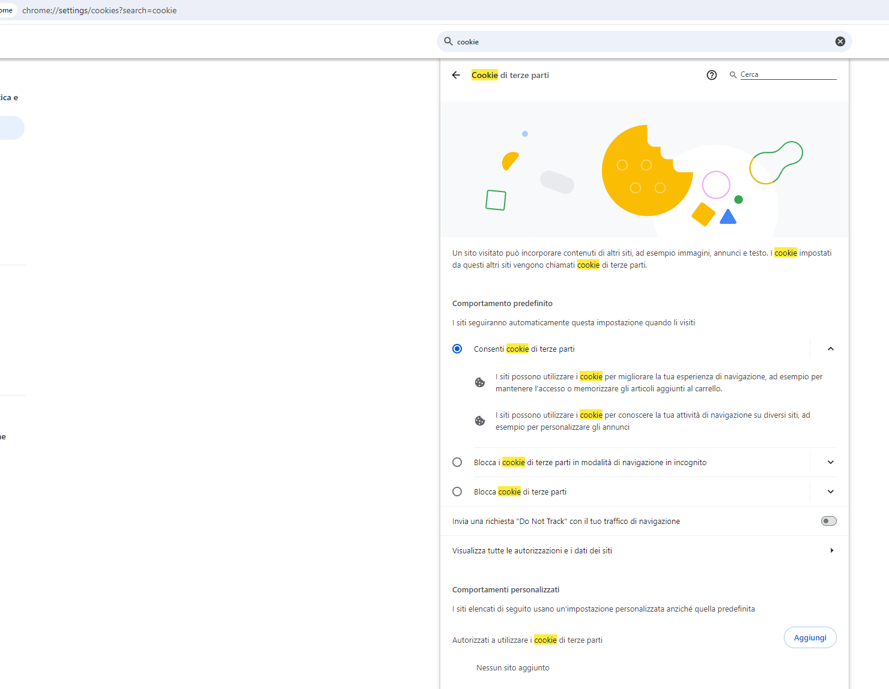

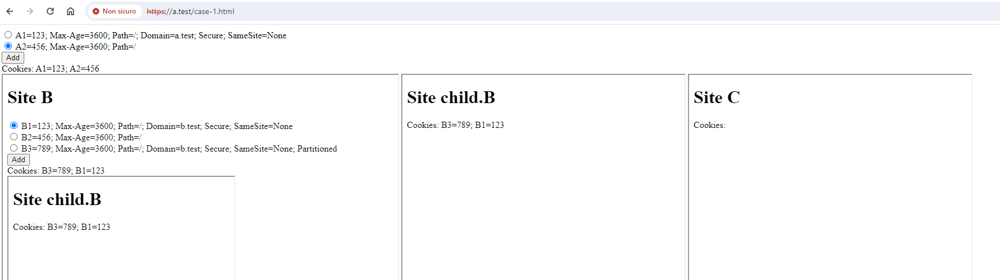

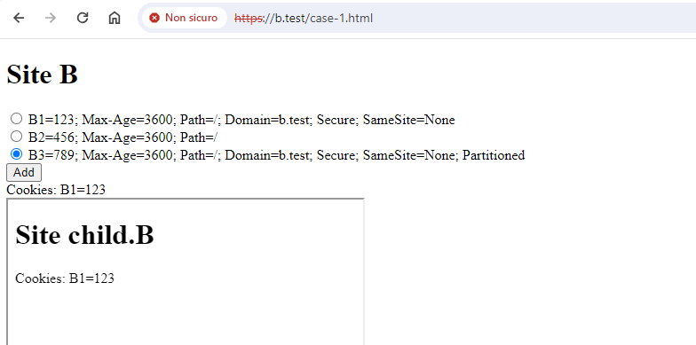

#### 3rd party cookie blocked

- go to <https://a.test/case-1.html>
- delete all cookies
- add all cookies both on site A and B

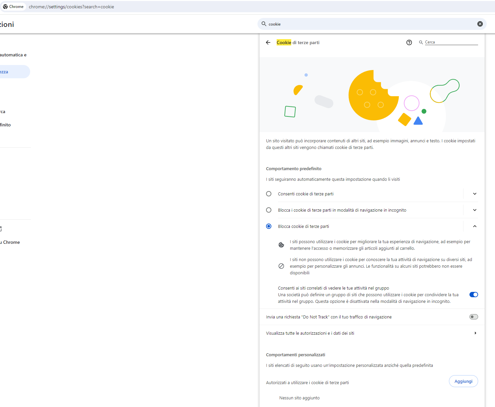

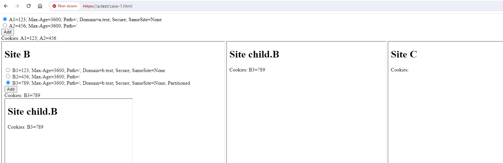

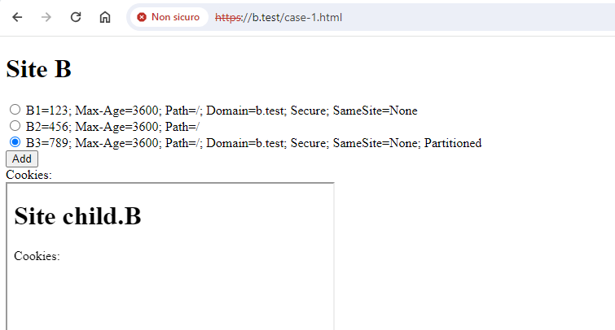

#### 3rd party cookie phaseout

Enable flag `chrome://flags/#test-third-party-cookie-phaseout`

- go to <https://a.test/case-1.html>
- delete all cookies
- add all cookies both on site A and B

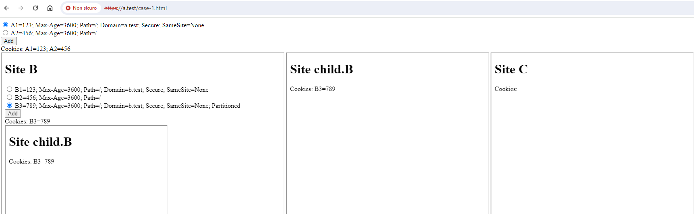

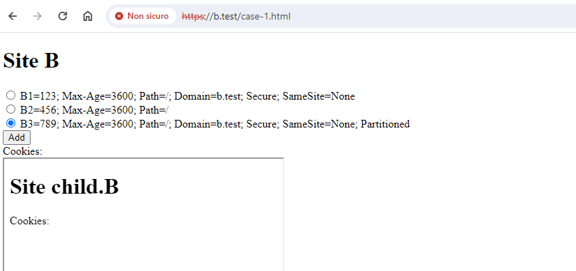

### Firefox 122

#### 3rd party cookie allowed

- go to <https://a.test/case-1.html>
- delete all cookies
- add all cookies both on site A and B

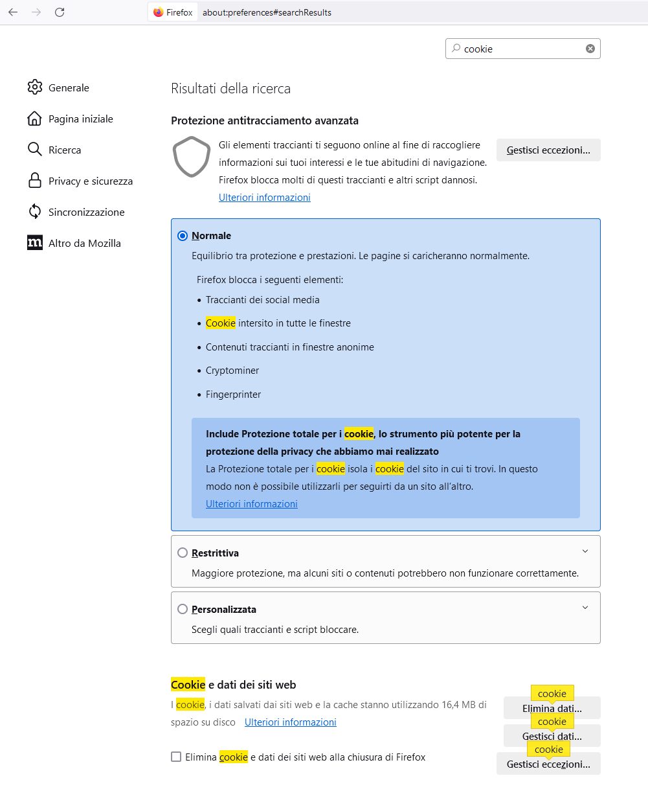

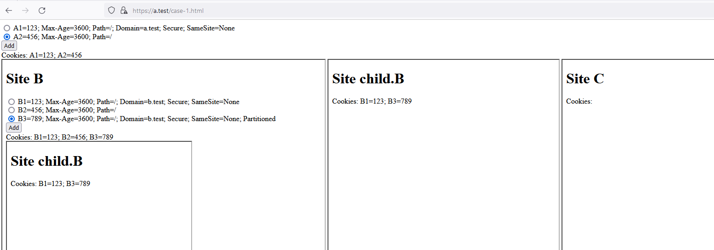

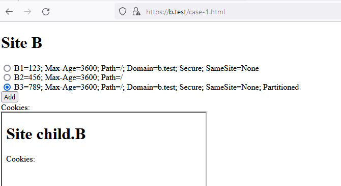

#### 3rd party cookie blocked

- go to <https://a.test/case-1.html>
- delete all cookies
- add all cookies both on site A and B

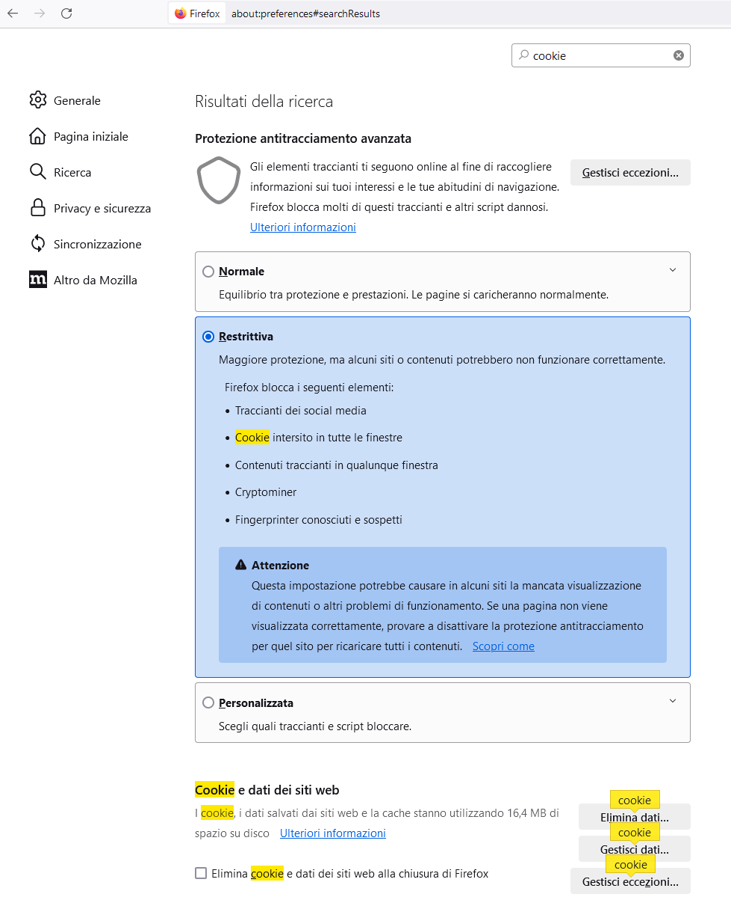

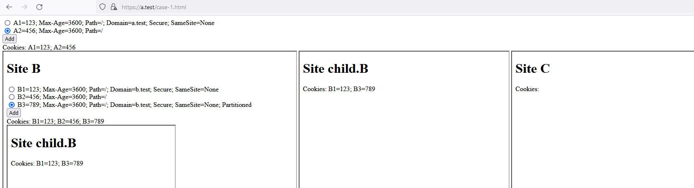

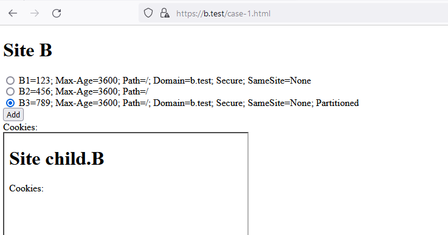


## Setup local env

### Generate SSL certificates

```
$env:PATH=$env:PATH + 'C:\Program Files\Git\usr\bin'
openssl req -x509 -nodes -days 365 -newkey rsa:2048 -keyout C:/a/projects/cookies-playground/chips/nginx-selfsigned.key -out C:/a/projects/cookies-playground/chips/nginx-selfsigned.crt
```

```
PS C:\a\projects\vitalegi\cookies-playground> openssl req -x509 -nodes -days 365 -newkey rsa:2048 -keyout C:/a/projects/cookies-playground/chips/nginx-selfsigned.key -out C:/a/projects/cookies-playground/chips/nginx-selfsigned.crt
>>
Generating a RSA private key
........+++++
......................+++++
writing new private key to 'C:/a/projects/cookies-playground/chips/nginx-selfsigned.key'
-----
You are about to be asked to enter information that will be incorporated
into your certificate request.
What you are about to enter is what is called a Distinguished Name or a DN.
There are quite a few fields but you can leave some blank
For some fields there will be a default value,
If you enter '.', the field will be left blank.
-----
Country Name (2 letter code) [AU]:
State or Province Name (full name) [Some-State]:
Locality Name (eg, city) []:
Organization Name (eg, company) [Internet Widgits Pty Ltd]:
Organizational Unit Name (eg, section) []:
Common Name (e.g. server FQDN or YOUR name) []:fe.company.eu
Email Address []:
```

### Configure hosts file

Update `C:\Windows\System32\drivers\etc\hosts` with

```
127.0.0.1	a.test
127.0.0.1	child.a.test
127.0.0.1	b.test
127.0.0.1	child.b.test
127.0.0.1	c.test
127.0.0.1	child.c.test
```

### Disable SSL validation

In the browser of your choice, open each domain and allow traffic.

### Nginx setup

<http://nginx.org/en/download.html>

`nginx.conf`'s server section

```
server {
    listen 443 ssl http2;
    server_name a.test;
    ssl_certificate     C:/a/projects/cookies-playground/chips/nginx-selfsigned.crt;
    ssl_certificate_key C:/a/projects/cookies-playground/chips/nginx-selfsigned.key;
    location / {
        root   html/a.test;
        index  index.html index.htm;
    }
}

server {
    listen 443 ssl http2;
    server_name child.a.test;
    ssl_certificate     C:/a/projects/cookies-playground/chips/nginx-selfsigned.crt;
    ssl_certificate_key C:/a/projects/cookies-playground/chips/nginx-selfsigned.key;
    location / {
        root   html/child.a.test;
        index  index.html index.htm;
    }
}

server {
    listen 443 ssl http2;
    server_name b.test;
    ssl_certificate     C:/a/projects/cookies-playground/chips/nginx-selfsigned.crt;
    ssl_certificate_key C:/a/projects/cookies-playground/chips/nginx-selfsigned.key;
    location / {
        root   html/b.test;
        index  index.html index.htm;
    }
}

server {
    listen 443 ssl http2;
    server_name child.b.test;
    ssl_certificate     C:/a/projects/cookies-playground/chips/nginx-selfsigned.crt;
    ssl_certificate_key C:/a/projects/cookies-playground/chips/nginx-selfsigned.key;
    location / {
        root   html/child.b.test;
        index  index.html index.htm;
    }
}
server {
    listen 443 ssl http2;
    server_name c.test;
    ssl_certificate     C:/a/projects/cookies-playground/chips/nginx-selfsigned.crt;
    ssl_certificate_key C:/a/projects/cookies-playground/chips/nginx-selfsigned.key;
    location / {
        root   html/c.test;
        index  index.html index.htm;
    }
}
```

### Nginx run

```bash
cd ./nginx-1.25.3
./nginx.exe
```
